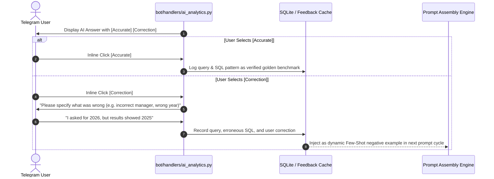

# Deus Logistics — AI Security, Governance & Zero-Leak Protocol

This specification outlines the security architecture, data protection mechanisms, and human-in-the-loop governance protocols governing the Artificial Intelligence components of the Deus Logistics platform.

---

## 1. Enterprise Threat Model for Cloud LLMs

Integrating public Large Language Models (e.g., Google Gemini, OpenAI GPT) into enterprise logistics workflows introduces four primary attack vectors and compliance risks:

| Risk Category | Threat Vector | System Impact | Mitigation Strategy |
| :--- | :--- | :--- | :--- |
| **Data Leakage** | Transmitting client names, margins, and freight rates to third-party model providers. | Loss of competitive advantage, breach of commercial NDAs. | **Zero-Leak Obfuscator** (entity masking + salt scaling). |
| **SQL Injection** | Malicious or hallucinated natural language queries generating destructive DDL/DML statements. | Data corruption, drop of operational tables, unauthorized data modification. | **Strict Read-Only AST Guardrails** & whitelist validator. |
| **Model Hallucination** | LLM generating plausible but mathematically false financial totals. | Misleading business decisions by executives. | **Deterministic Code Execution**: LLM generates SQL; SQLite executes math; LLM summarizes verified numbers only. |
| **Prompt Injection** | User input manipulating LLM system instructions or breaking out of operational role. | Jailbreaking, information disclosure of internal system prompts. | **Rigid Prompt Framing** and zero-trust schema-only exposure. |

---

## 2. Deterministic Data Masking Architecture

The **Data Masking Engine** (`services/ai/gemini_analyzer/obfuscator.py`) operates as a session-scoped data protection layer between local operational databases and external cloud AI APIs.

### 2.1. Dual-Vector Data Protection & Hybrid Deobfuscation

To avoid LLM text rounding artifacts and regex false positives (e.g. erroneously scaling years or shipment counts), the system implements a **Hybrid Deobfuscation Contract**:

```text
Raw Business Data (Local SQLite)
 ├── Entities: "ООО Логистик Транс", "Иванов И.И."
 └── Rates:    EUR 2,500.00 | Margin: EUR 450.00
       │
       ▼ [obfuscate_data()]
       │
 Sanitized Vector (Sent to Cloud LLM)
 ├── Entities: "Client_1", "Dispatcher_1"
 └── Structured Metrics: EUR 3,550.00 (Scaled by ephemeral salt α = 1.42)
       │
       ▼ [Google Gemini LLM Response via Structured JSON Schema]
       │
 Response Payload:
 {
   "synthesis": "Client_1 generated strong margin performance with Dispatcher_1...",
   "scaled_metrics": { "rate": 3550.0, "margin": 639.0 }
 }
       │
       ▼ [Hybrid Deobfuscation]
       │
 1. Numeric Restoration: scaled_metrics / α (Exact mathematical floating-point restoration)
 2. Entity Restoration: synthesis.replace(token, real_name) (Deterministic dictionary mapping)
       │
       ▼
 Final Restored Presentation (Telegram UI)
 ├── Text: "ООО Логистик Транс generated strong margin performance with Иванов И.И...."
 └── Restored Metrics: EUR 2,500.00 | Margin: EUR 450.00
```

### 2.2. Mathematical Salt Scaling on Tabular Aggregates
Financial amounts (freight rates, carrier costs, gross margins) undergo scalar transformation strictly on tabular aggregates:

$$S_{\text{obfuscated}} = S_{\text{actual}} \times \alpha \quad \text{where } \alpha \in [1.2, 1.8]$$

- The salt $\alpha$ is generated ephemerally per user query session and stored in memory only.
- Relational proportions (e.g., Margin % = $\frac{\text{Margin} \times \alpha}{\text{Rate} \times \alpha} = \frac{\text{Margin}}{\text{Rate}}$) remain mathematically invariant, allowing the LLM to synthesize percentage-based insights without access to actual financial records.
- Deobfuscation is performed in deterministic application code by dividing `scaled_metrics` by $\alpha$, preventing model rounding errors (e.g. converting "45.5k" into fractional noise) and eliminating regular expression false positives on dates (2026) or shipment counts.

### 2.3. Deterministic Entity Tokenization
- Real entity names (customers, carriers, logistics managers) are mapped to deterministic tokens (`Customer_1`, `Carrier_1`, `Manager_1`).
- The translation table is maintained in the local session state.
- In synthesis text, tokens are replaced via direct string mapping (`synthesis.replace(token, real_name)`).
- Interceptors or model loggers observe only anonymized relationships between synthetic entities with salted figures.

---

## 3. Text-to-SQL Guardrails & AST Validation

Natural language queries are parsed into SQLite queries (`services/ai/gemini_analyzer/text_to_sql.py`) under multi-stage defensive guardrails:

### 3.1. Schema-Only Exposure
The LLM is provided only with database metadata:
- Table names (`deals_2024`, `deals_2025`, `deals_2026`).
- Column definitions (`date_deal`, `logistic_clean`, `rate_client`, `rate_carrier`, `client_clean`, `carrier_clean`).
- **Zero row data or sample records** are included in the prompt.

### 3.2. AST Validation & Engine-Level Safety Policy
Every SQL string generated by the LLM undergoes two-tier defense before execution:

1. **Abstract Syntax Tree (AST) Parsing via `sqlglot`**:
   - The query is parsed into a structured AST tree (`sqlglot.parse(sql_query, read="sqlite")`).
   - The root statement is verified to be strictly an `exp.Select` or `exp.Union` (supporting period comparison queries).
   - Multi-statement payloads (e.g., `SELECT 1; DROP TABLE shipments;`) are rejected at the parser level.
   - Eliminates false positives on legitimate counterparty names containing substrings like "Drop" (e.g., "ООО Дропшиппинг").
2. **Engine-Level Read-Only Connection (`mode=ro`)**:
   - The database connection is established via POSIX URI with explicit read-only parameter:
     `sqlite3.connect(f"file:{safe_path}?mode=ro", uri=True)`
   - SQLite hardware-level directive `PRAGMA query_only = ON;` is executed immediately upon connection, rendering write or schema modification attempts impossible even in the event of parser bypass.
3. **Non-Blocking Concurrency (`WAL Mode`)**:
   - Write-Ahead Logging (`PRAGMA journal_mode = WAL;`) is set persistently in the database header during ETL construction. Analytical reads from the Telegram bot execute concurrently without locking or conflicting with database sync operations.
4. **Implicit Row Limitation & Timeout**:
   - Result sets without explicit limits are constrained to prevent memory exhaustion, and execution is bound to a strict 5.0-second timeout.

---

## 4. Active Human-in-the-Loop (HITL) Feedback Loop

To guarantee continuous quality improvement without retraining base foundation models, the system incorporates an active user feedback mechanism:



### 4.1. Dynamic Few-Shot Prompt Adaptation
- Feedback entries are serialized into structured evaluation pairs.
- Verified correct queries are promoted to the active Few-Shot prompt catalogue.
- Corrected mistakes are appended as explicit negative constraints (e.g., *"When user mentions 'this year', always resolve to 2026, not 2025"*).

---

## 5. Operational Governance & Verification Framework

Production deployment of generative AI models requires structured operational governance:

1. **Boundary & Guardrail Enforcement**: Strict mathematical data obfuscation, tokenization, and permission barriers maintaining non-deterministic LLMs inside deterministic operational boundaries.
2. **Evaluation & Verification Frameworks**: Continuous automated regression test suites and end-to-end user simulations (`tests/test_obfuscator.py`, `tests/test_financial_math.py`) ensuring zero semantic or calculation drift.
3. **Continuous Audit & Monitoring**: Systematic logging of query-response pairs, execution metrics, and user validation feedback for continuous quality assurance.
