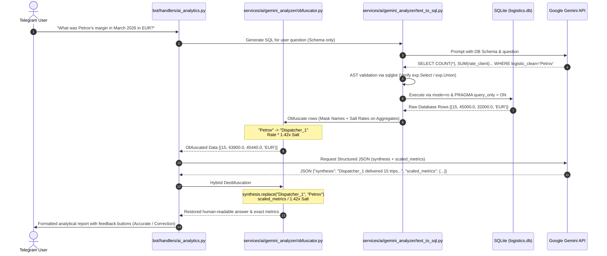
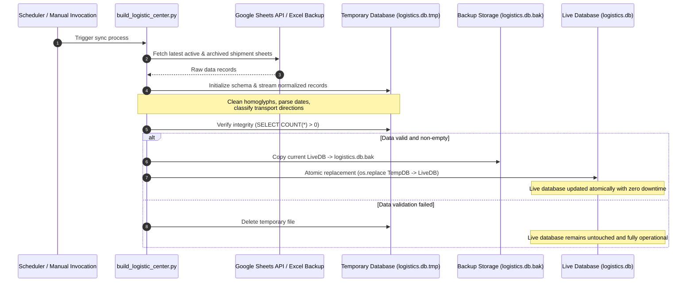
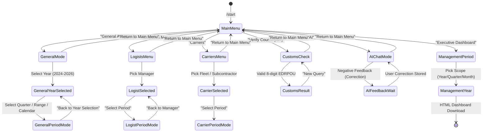

# Deus Logistics — System Architecture Specification

This document provides a comprehensive technical breakdown of the architecture, design patterns, data flows, and reliability mechanisms implemented in the Deus Logistics platform.

---

## 1. Architectural Style & Layering

The system is structured following **Clean Architecture / Layered Architecture** principles, enforcing a strict unidirectional dependency rule:

```text
┌─────────────────────────────────────────────────────────────┐
│                    Presentation Layer                       │
│  Telegram Bot (bot/handlers, bot/keyboards, bot/main.py)    │
└──────────────────────────────┬──────────────────────────────┘
                               │ depends on
                               ▼
┌─────────────────────────────────────────────────────────────┐
│                      Service Layer                          │
│  services/reports, services/ai, services/outreach, ETL      │
└──────────────────────────────┬──────────────────────────────┘
                               │ depends on
                               ▼
┌─────────────────────────────────────────────────────────────┐
│                 Data Processing & Normalization             │
│  services/data_processing/cleaning.py, path_manager.py      │
└──────────────────────────────┬──────────────────────────────┘
                               │ depends on
                               ▼
┌─────────────────────────────────────────────────────────────┐
│                   Infrastructure & Storage                  │
│  SQLite (logistics.db, trade_data.db), NBU Cache, Filesystem│
└─────────────────────────────────────────────────────────────┘
```

### Layer Responsibilities:
1. **Presentation Layer (`bot/`)**:
   - Manages user sessions and Telegram Bot API events via `aiogram 3.x`.
   - Contains zero raw SQL queries or business calculation logic; delegates all operations to the service layer.
   - Enforces role-based access control via `AuthMiddleware`.
2. **Service Layer (`services/`)**:
   - Contains high-level business capabilities: financial yield calculations (`management_report.py`), customs dossier aggregations (`customs_report.py`), AI interaction pipelines, and browser-based lead generation.
3. **Data Processing Layer (`services/data_processing/`)**:
   - Pure domain helper utilities for string sanitation, homoglyph replacement, rate extraction, and multi-format date parsing. Independent of external frameworks.
4. **Infrastructure Layer (`data/`, `config/`)**:
   - SQLite databases, caches, and filesystem path resolution via `path_manager.py`.

---

## 2. Sequence Diagrams

### 2.1. Zero-Data-Leak AI Natural Language BI Query
Demonstrates how user natural language questions are converted into answers without exposing commercial secrets to the cloud LLM:



---

### 2.2. Safe Atomic ETL Database Rebuilding
Guarantees uninterrupted operation of the live bot during data syncs:



---

## 3. Finite State Machine (FSM) Design

The Telegram bot uses `aiogram.fsm` to isolate user dialogue contexts:



---

## 4. Multi-Tier Path & Database Fallback Architecture

To ensure portable local development without transferring multi-gigabyte files across networks, the system implements a multi-tier database resolver (`services/path_manager.py`):

1. **Customs Database Resolution**:
   - *Tier 1 (Production)*: Searches `ТБ_26/trade_data_2026.db` (32.8 GB SQLite declarations database).
   - *Tier 2 (Development/Demo)*: Falls back transparently to `data/database/trade_data_sample.db` (~94 KB synthetic fixture matching schema).
2. **Configuration Resolution**:
   - *Tier 1*: `config/config.json`.
   - *Tier 2*: Root fallback `config.json`.
3. **Rates & Currency Cache Resolution**:
   - *Tier 1*: `data/cache/nbu_rates_cache.json`.
   - *Tier 2*: Root fallback `nbu_rates_cache.json`.

---

## 5. Runtime Execution Topology

```text
Host Environment (Windows / Windows Server)
 └── Python 3.12 Virtual Environment (`venv`)
      └── Service: Telegram Bot (`logistic_bot.py`)
           ├── Core Engine: aiogram 3 Event Loop
           ├── Subprocess Worker: Playwright Chromium (LinkedIn Outreach)
           ├── Local Storage (Direct I/O):
           │    ├── data/database/logistics.db (SQLite WAL)
           │    ├── trade_data_2026.db (32.8 GB Customs Dataset)
           │    └── data/cache/ (NBU Currency Cache)
           ├── Configuration: config/config.json & .env
           └── External Cloud Integrations:
                ├── Google Sheets API (ETL Ingestion)
                ├── Google Gemini API (Text-to-SQL Analytics)
                └── Telegram Bot API
```
