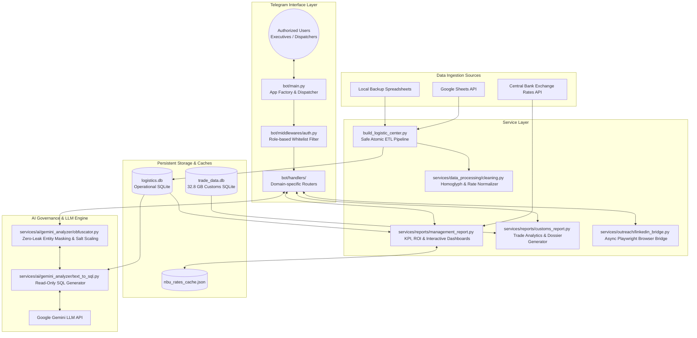

# Deus Logistics — System Architecture & Design Specifications
> **Enterprise Logistics Intelligence & Automation Platform**  
> Architectural blueprint, security guardrails, data masking protocols, and systems design specifications.

---

> [!NOTE]
> **Repository Scope & Architectural Showcase**:  
> This repository serves as a **System Architecture & Technical Specifications Showcase** presenting the engineering design, threat modeling, AI security guardrails, and operational topology of the Deus Logistics platform.  
> Production deployment code, proprietary logistics shipment datasets, and commercial ETL integrations are maintained in an enterprise private repository under corporate access control.

## System Overview & Architecture

Deus Logistics is an enterprise platform designed for freight logistics management, customs intelligence, and automated lead generation. The platform decouples presentation, domain services, data pipelines, and external AI providers to ensure fault tolerance, operational security, and sub-second analytics.

### Key Engineering Highlights:
- **Modular Monolith Architecture**: Layered domain decoupling into `bot/` (presentation/handlers), `services/` (domain logic, reports, data cleaning, outreach), `data/` (storage/cache), and `config/`.
- **Zero-Data-Leak AI Integration**: Deterministic session-scoped data masking layer (`obfuscator.py`). Commercial names and financial figures are obfuscated locally before queries are submitted to public LLMs (Google Gemini API).
- **High-Performance Multi-Gigabyte Local Storage**: Sub-second queries across a **32.8 GB** customs declarations SQLite dataset using compound B-Tree indexes and optimized aggregation subqueries.
- **Safe Atomic Transactions**: Database rebuilding guarantees zero downtime or corruption through an atomic swap pattern (`.tmp` -> verification -> `.bak` backup -> `os.replace()`).
- **Comprehensive Automated Verification**: 37 integration & unit tests (`pytest`, 100% pass rate) validating financial mathematics, string normalization, AST SQL security guardrails, and data masking pipelines.

---

## System Component Architecture

---

## Core System Modules

### 1. Telegram Operations Core (`bot/`)
- Built on **aiogram 3.x** using modular routers for each business function:
  - `operational.py`: Company-wide metrics, annual statistics, manager scorecards, interactive calendar range picker.
  - `customs.py`: Instant 8-digit tax code (EDRPOU) verification, short summary cards, and standalone HTML dossier downloads.
  - `management.py`: Generation of interactive executive HTML dashboards featuring dynamic currency toggling (UAH/USD/EUR) and Chart.js visualizations.
  - `ai_analytics.py`: Natural language Text-to-SQL business intelligence with user evaluation loop (Accurate / Correction) for continuous prompt refinement.
  - `outreach.py`: Host workstation validation, automated LinkedIn company discovery, and connection invitation workflows.
- Protected by `AuthMiddleware` with role-based access control (Admin, Accountant, Logistics Manager).

### 2. Zero-Leak AI Natural Language BI (`services/ai/gemini_analyzer/`)
- Enables non-technical managers to query the operational database in plain Russian/Ukrainian.
- **Privacy Architecture**:
  1. Translates natural language question into strict Read-Only SQL SELECT.
  2. Executes SQL locally against SQLite.
  3. **Obfuscation**: All real company and personal names are replaced with tokens (`Client_1`, `Dispatcher_2`), and rates are multiplied by a confidential randomized salt coefficient.
  4. Only sanitized, scaled numbers are sent to Google Gemini for final analytical synthesis.
  5. The bot replaces tokens with real names locally before presenting the answer to the user.

### 3. Customs Trade Intelligence (`services/reports/customs_report.py`)
- Analyzes foreign trade activity from a **32.8 GB** customs database (millions of declarations for 2025–2026).
- Instantly extracts:
  - Total declaration counts (Customs Declarations / VMD), net weight in metric tons, USD turnover.
  - Top 3 export/import partner countries.
  - Top 5 declared HS Commodity Codes (UKTVED).
  - Standalone, styled HTML dossier generated in under 3 seconds.
- Transparent fallback to `trade_data_sample.db` (~94 KB) for development and public demonstrations.

### 4. Resilient Atomic ETL Pipeline (`build_logistic_center.py`)
- Continuous integration of distributed Google Sheets and local spreadsheets into a unified relational model.
- Solves data quality issues: homoglyph normalization (Latin 'c', 'o', 'p' vs Cyrillic 'с', 'о', 'р'), currency cleaning, date range parsing.
- **Atomic Swap Guarantee**: The database is compiled into a temporary `.tmp` file, validated for non-empty tables, backs up the active database to `.bak`, and atomically replaces the live file using `os.replace()`.

### 5. Automated LinkedIn Outreach (`services/outreach/`)
- Asynchronous bridge spawning a dedicated Playwright Chromium browser.
- Multi-tier search algorithm (Google/Bing search first to avoid rate-limits, falling back to LinkedIn direct search).
- Automatically identifies decision-makers in logistics, procurement, and supply chain, sending personalized connection invites within platform safety thresholds.

---

## Verification & Testing Contract

> **Verification Specification**: The contract below defines the test suite topology implemented in the private repository to validate financial formulas, AST guardrails, and data masking pipelines.

The platform architecture enforces a strict verification contract covering 37 unit and integration tests (100% pass rate):

### Test Suite Breakdown:
- `tests/test_cleaning.py` (18 tests): String normalizations, homoglyph transliteration (Latin/Cyrillic), currency recognition, and flexible date parser formats.
- `tests/test_sql_guardrails.py` (7 tests): AST syntax parsing via `sqlglot`, `Select` and `Union` validation, rejection of DDL/DML injection attacks.
- `tests/test_financial_math.py` (5 tests): Margin calculations, average trip yield, multi-currency ROI formulas, and zero-division resilience.
- `tests/test_customs_report.py` (4 tests): Trade aggregation subqueries, summary card formatting, and HTML dossier byte-level validity.
- `tests/test_obfuscator.py` (3 tests): Entity token replacement, salt rate scaling ($\alpha \in [1.2, 1.8]$), and exact reverse deobfuscation.

---

## Runtime Topology & Deployment Specifications

### 1. Process Execution Model
- **Service Boundary**: Decoupled async Telegram bot and background Playwright browser automation worker.
- **Subprocess Isolation**: Background Chromium subprocess execution prevents browser memory spikes from impacting the primary `aiogram` event loop.
- **Runtime Environment**: Python 3.12 virtual environment (`venv`) with direct execution on Windows host.

### 2. Analytical Database Engine
- **Storage Engine**: SQLite 3 with Write-Ahead Logging (`PRAGMA journal_mode = WAL;`) activated during atomic ETL builds.
- **Query Isolation**: Analytical connections open exclusively via POSIX URI with engine-level read-only directives (`mode=ro` and `PRAGMA query_only = ON;`).
- **Safe Atomic Swaps**: ETL pipelines compile new relational tables in temporary storage (`.tmp`), verify record integrity, backup current data (`.bak`), and atomically swap live databases via `os.replace()`.

---

## Technical Documentation

- [System Architecture Specification](ARCHITECTURE.md)
- [AI Governance, Security & Zero-Leak Protocol](AI_SECURITY_AND_GOVERNANCE.md)
- [Project Technical Datasheet](PROJECT_OVERVIEW.md)
